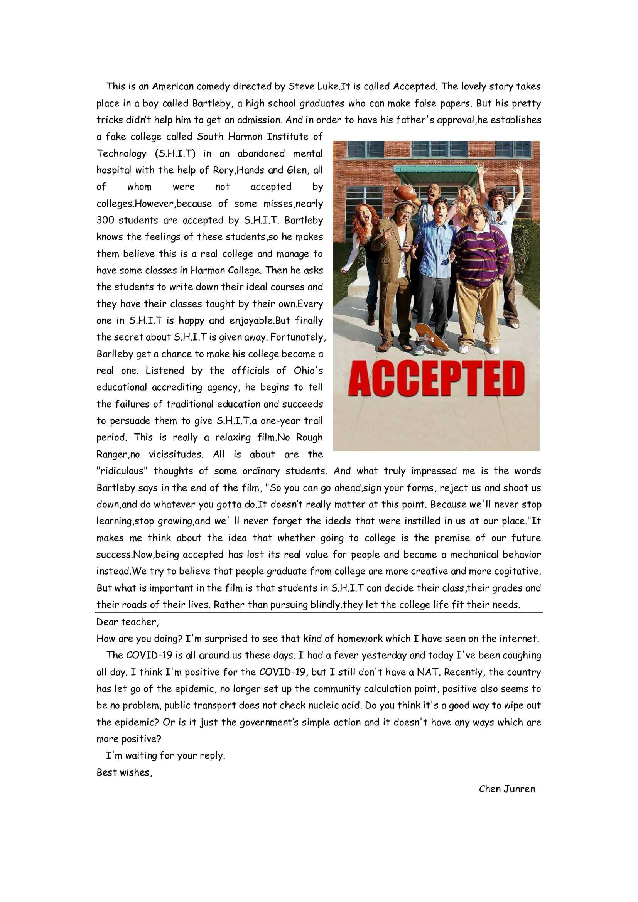

# 项目文档页 - 2022级5&6班的英语栈

## 英语栈来源(即[2022年12月的特殊周作业](https://eng.chenjunren.site/202212specialweek/))

2022年12月的23号，我们因为疫情的原因在家已经上了一个多月的网课了。**但是**，我们的英语老师布置了一份开放作业，我依稀记得是下面这样的。

> *Hi, class.*
> *We’ve had a hard week,so there is no homework this weekend. I just hope you can eat well, sleep well and be well.*
> *It would be very nice if you could choose one the the following things to do.*
> *1.share your favourite English film with me and post a poster together with a few words why you like it.(Po出你最爱的电影的海报➕理由)*
> *2.Write something to me in English.(And I promise to write you back)*
> *Ps: Stay positive when you are positive!*

这是我交的作业，但是这不是重点，重点是**我另附的一句话**：

> If you cannot see the image, you can download it or just visit the link below:
>
> https://chenjunren.site/img/Homework.jpg
>
> **Besides, https://chenjunren.site is my own website. You can spend a few minutes taking a look at it.🙃**

然后老师竟然就回我了！！！

> Hi,boy. It's soo cool to have your own website. I suddenly have an idea that **you can set up one for the class**. What do you think of this? Contact me on QQ. 

聊的很投机，于是我也就在当晚就把网站框架用[Wordpress](https://wordpress.org)搭好了。我没有选择[Hexo](https://hexo.io/zh-cn/index.html)和[Typecho](https://typecho.org)的原因是当时没多少时间去配置(这俩都是多开放性的框架，需要人工一个一个一个配置)，而且我之前也用Wordpress搭过我的博客~~(虽然现在关停了)~~，还比较熟练。

第二天，我就应老师把这次作业的优秀作业放到了网站上。

此其所由矣。

---

2023年3月18日留

现在来看，当初建这个网站并没有花我多少东西，无非就是两个9元的域名、一个29.9元/月的服务器和2个小时。你们不要看信息很复杂，其实真的很简单。就以我搭这个网站为例，我是这样搭的：

> 1.  去阿里云万网买域名 花费9元&15分钟
>
> 2. 去[星辰云](https://starxn.com)(现已迁至阿里云)买云服务器 花费29.9元&10分钟
>
> 3. 配置云服务器 花费0元&15分钟
>
> 4. 去wordpress官网下载安装包，上传安装包至服务器并解压  花费0元&5分钟
>
> 5. 将域名绑定至云服务器IP 花费0元&3分钟
>
> 6. 访问域名安装网站 花费0元&10分钟
>
> 7. 配置网站 花费0元&45分钟
>
> 8. 老师说把隔壁5班也加上，所以再去阿里云万网买域名 花费9元&15分钟
>
> 9. 将域名绑定至云服务器IP 花费0元&3分钟
>
> 10. 测试并结束
>
>     一共花费47.9元和121分钟

## [2023年元旦特殊作业](https://eng.chenjunren.site/2023newyearsday/)

