# 目录

[TOC]

# 七上

## 第二单元 - 有理数

### 2.1 正数与负数

1. 正数：大于0的数

2. 负数：小于0的数

**0不是正数也不是负数**

3. 非正数：$\leq0$的数，即为$0$和负数

4. 非负数：$\geq0$的数，即为$0$和正数

5. 应用

|   正数   | 收入     | 盈利     | 上升     | 存入     | ...     |
| :------: | -------- | -------- | -------- | -------- | ------- |
| **负数** | **支出** | **亏损** | **下降** | **取出** | **...** |

---

### 2.2 有理数

#### 有理数

1) 能写成$\frac{m}{n}$的形式的数，其中$n\neq0$，$m\in Z$

2) 整数与分数的统称

##### 分类

3. 无理数：无限不循环小数(如$\pi,\sqrt{2},1.\dot{0}\dot{1}$等)

4. 证明$\sqrt{2}$为无理数

   $$证明:假设\sqrt{2}为有理数,则有\\\frac{m}{n}=\sqrt{2}\\根据平方根的意义得2=(\frac{m}{n})^2=\frac{m^2}{n^2}\,即2n^2=m^2\\\therefore m为偶数\\设m=2k,k\in N*\\\therefore2n^2=4p^2,即n^2=2p^2\\\therefore n为偶数\\\therefore m,n均为2的倍数,这与m,n没有大于1的公因数相悖\\\therefore\sqrt{2}不可表示为\frac{m}{n}\\\therefore \sqrt{2}不为有理数即其为无理数$$

   

(此为八年级上册4.3实数中的方法)

---

### 2.3 数轴

1. 数轴三要素：**原点**(下图点O)，**正方向**(下图数轴右箭头)，**单位长度**(下图文字详解)

   

2. **任意数均可在数轴上表示**
3. 数轴左侧点**小于**右侧
4. 方法
   1. 画数轴
   2. 标数字
   3. 连接

---

### 2.4 绝对值和相反数

#### 绝对值

​	几何 - 一个数在数轴上到原点的距离

​	代数 - 一个数的绝对值，正数是它本身，负数是它的相反数，**0的绝对值是0** 

​	绝对值一定大于等于$0$

​	$	a$的绝对值写作$|a|$

​	由绝对值倒推原数得$\pm a$

​	$|\pm a|=\begin{cases}a(a>0)\\0(a=0)\\-a(a<0)\end{cases}$

#### 相反数

​	**只有符号不同**的两数<u>互为相反数</u>

​	**0的相反数为0**

​	表示$a$的相反数可在前加负$(-)$号

​	奇数个负号为负，偶数个负号为正

---

### 2.5 有理数运算

#### 1. 加法

##### 法则

​	同号两数相加，取**相同**的符号，并把绝对值相加

​	异号两数相加，取**绝对值较大的加数**的符号，并用较大的绝对值减去较小的

互为相反数的两数相加得$0$，如$-3+3=0,-\pi+\pi=0$

$0$加任何数都得该数，如$5+0=5,\sqrt{2}+0=\sqrt{2}$

##### 运算律

​	交换律 $a+b=b+a$

​	结合律 $a+(b+c)=(a+b)+c$

#### 2. 减法

##### 法则

​	减去一个数等于**加**上这个数的**相反数**

​	任何数减去$0$都得该数，如$5-0=5,\sqrt{2}-0=\sqrt{2}$

​	$0$减去任何数都得该数的**相反数**

$a-b$可读作"$a$减$b$"或"$a$与负$b$的和"

线段$AB$的长度$=|a-b|=|b-a|,(a-b)=-(b-a)$

#### 3. 加减混合运算

绝对值有括号性 $|a|=\begin{cases}(a)\\(-a)\end{cases}$

##### 简便计算

###### 	凑整

​		$93.1-8.9+6.9=(93.1+6.9)-8.9=91.1$

###### 	同号加数结合

​		$22-9-20+|-27|=(22+27)+(-9-20)=20$

###### 	同分母结合

​		$\frac{1}{9}-\frac{7}{8}+1\frac{6}{9}+|-\frac{2}{9}|-2\frac{1}{8}=(\frac{1}{9}+1\frac{6}{9}+\frac{2}{9})+(-\frac{7}{8}-2\frac{1}{8})=1$

###### 	相反数结合

​		$\frac{1}{9}-\frac{7}{8}-|-\frac{1}{9}|+\frac{1}{8}=\frac{1}{9}-\frac{1}{9}-(\frac{7}{8}-\frac{1}{8})=-\frac{3}{4}$

加减混合运算可以从左向右运算，**可以统一为加法**(只有加法的和式，即代数和)

#### 4. 乘法

##### 法则

​	两数相乘，**同号得正**，**异号得负**，并把**绝对值相乘**

​		 $$(+) \times (+) = (+)\\ (+) \times (-) = (-)\\(-)\times(+)=(-)\\(-)\times(-)=(+)$$

​	$0$乘任何数都得$0$

##### 运算律

​	交换律 $a \cdot{b}=b\cdot{a}$**

​	结合律 $(a\cdot{b})\cdot{c}=a\cdot({b}\cdot{c})$

​	分配律 $(a+b)\cdot{c}=a\cdot{}c+b\cdot{}c$

##### 奇负偶正

​	奇数个负数相加得负，偶数个负数相加得正

##### 倒数

​	两个乘积为$1$的数**互为倒数**，如$5$和$\frac{1}{5}$，其中一个数被称为另一个数的倒数

​	$\pm1$的倒数为$\pm1$，**$0$没有倒数**

#### 5. 除法

##### 法则

​	1. 两数相处，同号得正，异号得负，并把绝对值相除

​	2. **除以一个数就等于乘上这个数的倒数**

​	$0$除以任何数都得$0$，如$0\div5=0$

​	(以简便来说)除法中若可以整除则用法则1，反之则用法则2

#### 6. 乘方

​	乘方写作$a^b$的形式，其中$a$称为底数，$b$称为指数，读作"$a$的$b$次方"，统称**幂(见七年级下册第八单元 - 幂的运算)**

​	$\begin{cases}a^n>0\space(a>0)\\a^n=0\space(a=0)\\a^{2n}>0,a^{2n+1}<0\space(a<0)\end{cases}$

​	$0^2=0,1^2=1\\0^3=0,1^3=1,(-1)^3=-1$

#### 7. 简单的混合运算

#####  运算顺序

​	括号&绝对值 >> 乘方&开方 >> 乘除法 >> 加减法

##### **非负性方程**

​	一般形式$a+b=0(a\ge0,b\ge0)$

​	绝  对  值$|a+3|+|b-1|=0(|a+3|\ge0,|b-1|\ge0)$

​	乘        方$(a-2)^2+(b+4)^2=0((a-2)^2\ge0,(b+4)^2\ge0)$

#### 8. 复杂的混合运算

​	无

#### 9. 科学计数法

​	写作$a\times10^n(n\in N*,1\le|a|<10)$

​	$n$可看作该数**整数位数**$-1$

​		$103.12=1.0312\times10^2$

---

## 第三单元 - 代数式

### 3.1 字母表示数

#### 特点

1. 字母与数字相乘，乘号一般省略或写成*点乘形式*($3\cdot x 或3x$)
2. 填空中若**多项式**后有**单位**，则需加括号$((x-2)个人)$

3. 有除法写**分数** ($x\div3=\frac{x}{3}$)
4. 有相同因式写**乘方**($(x+1)(x-2)(x+1)=(x+1)^2(x-2)$)
5. **带分数**与字母项乘，转换为**假分数**($1\frac{3}{4}\cdot x=\frac{7}{4}x$)
6. 数与字母相乘，字母系数$1$常省略，$-1$常写作$-$ ($1a=a,-1a=-a$)

---

### 3.2 代数式

#### 代数式

​	**只有运算符**(无逻辑符号$=,\ge,\le,<,>,\ne$等)并**含有数字或字母的式子**

​	单独的数($3$)或字母($a$)也是代数式

#### 单项式

​	只有**数字与字母的积**的代数式($33x,42x^2y$)

​	单独的数或字母也是单项式

​	单项式的数字因式叫**系数**

​	单项式的字母的次数叫**单项式的次数**

#### 多项式

​	由**多个单项式的和或差**组成的式子($3x+6y^2,x-2y+3xy$)

​	多项式中的每一个单项式都叫**多项式的项**

​	多项式中*单项式的个数*叫**项数**

​	多项式中**最高次数的单项式的次数**叫**多项式的次数**

​	多项式的名称：$n$次$m$项式

​	多项式中因式没有字母的项叫**常数项**

> **单项式与多项式统称为整式**
>
> 分母中含有字母的式子叫**分式**

对于任意项， 若该项系数为$0$，则该项为$0$

---

### 3.3 代数式的值

#### 代入数字

​	$x^2y+2x-y^3$

​		已知$x=4,y=3$

​			$$原式=4^2\times3+2\times4-3^3\\=48+8-27=29$$

​		已知$(x-4)^2+|y-3|=0$

​			$$\because(x-4)^2+|y-3|=0\\\therefore x=4,y=3\\\therefore原式=4^2\times3+2\times4-3^3=48+8-27=29$$

#### 代入代数式

​	$(x-y)^3+(y-x)^2-(2x-2y)$

​		已知$x-y=2$

​			$原式=2^3+2^2-2\times2=8$

​		已知$x-y-3=2$

​			$由x-y-3=-1得x-y=2\\代入原式得2^3+2^2-2\times2=8$

#### 程序性求值

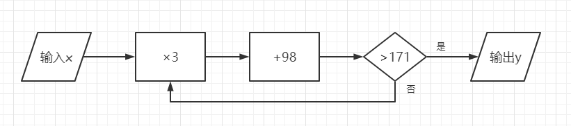

---

### 3.4 合并同类项

#### 同类项

​	***字母*指数和*数字*指数**均相同的多个式子

​	同类项的判定**与系数无关**

​	同类项的判断**与字母的顺序无关**

​	同类项要么同时为单项式，要么同时为多项式

#### 合并同类项

​	合并同类项是用**乘法分配律**将几个同类项的系数**提出并合并**后化为最简形式

​	**系数相加得系数，指数不变**

​	互为相反数的两数的偶次幂相同 >> 为同类项

​	互为相反数的两数的奇次幂互为相反数 >> 为同类项

---

### 3.5 去括号

#### 去括号

​	多项式外的符号为正(加)号($+$)，直接去括号

​	多项式外的符号为负(减)号($-$)，去括号需变符号($\times(-1)$)

#### 	加括号

​	加正(加)号**不变号**

​	加负(减)号**变号**

多项式外若为乘号，则将省略的乘号或点乘号添加并用**乘法分配律**将其拆分

$$-2(4+a-7)\\=-2\times4-2\cdot a-7\times-2\\=-8-2a+14=6-2a\\\\-2(4+a-7)\\=-[2\times4+2\cdot a+2\times(-7)]\\=-[8+2a-14]=6-2a$$

---

### 3.6 整式的加减

##### 化简步骤

1. 去括号
1. 合并同类项

*将未知数的值代入化简后的式子叫求值*

---

## 第四单元 - 一元一次方程

### 4.1 从问题到方程

由等号(=)连接的式子叫等式，表示相等关系

**含有未知数的式子叫方程**，分式方程也是方程 (分式方程：分母中含有未知数的方程)

$m$元$n$次方程，即有$m$个未知数(字母)，且最高次项次数为$n$，只能为**整式方程**

​	一元一次方程，即有一个未知数，且最高次数为1的**整式方程**

#### 等式的分类

​	恒等式 - 一定成立 ($5=5,\pi=\pi$等)

​	条件等式 - 可能成立 ($a=b,5x+3y-4z=0$等)

​	矛盾等式 - 不能成立 ($a-1=a,5-\pi=\pi$等)

---

### 4.2 解一元一次方程

#### 方程的解

​	使方程成立的未知数的值

#### 判断方程的解

1. 将结果代入方程
1. 判断等式是否成立
1. 得出结论

多个方程的解的形式:

$$\begin{cases}x= a\\y=b\\z=c\\...\end{cases}$$

#### 解方程

​	解方程的过程

##### 	步骤

1. **去分母(最小公倍数&乘法分配律&等式的性质)**

2. **去括号(乘法分配律)**

3. **移项(等式的性质)**

3. **合并同类项(乘法分配律)**
3. **系数化为一(等式的性质)**

#### **等式的性质**(重要)

​	等式两边同时加减同一个数，等式仍成立

​		$若a=b,则a\pm2=b\pm2$

​	等式两边同时乘或除以一个相同的**不是0**的数，等式仍成立

​		$若a=b,c\ne0,则ac=bc,\frac{a}{c}=\frac{b}{c}$

#### 移项

​	将一个数字或字母由方程的一边转移到另一边的过程叫移项

​	移项需改变符号 ($a-2=4 >> a=4+2$)

---

### 4.3 用一元一次方程解决问题

#### 1. 解决问题的一般步骤

1. 审 - 等量关系
2. 设 - 找未知数
3. 列 - 列出方程
4. 解 - 解出方程
5. 验 - 检验答案
6. 答 - 回答问题

#### 2. 列表分析问题

无

#### 3. 用线性示意图分析问题

无

#### 4. 列表或用线性示意图分析问题

##### 行程问题

###### 相遇

​	$S_和=(V_甲+V_乙)\times T$

###### 追及

​	$S_差=(V_甲-V_乙)\times T$

##### 工程问题

工作总量=工作速度$\times$工作时间 ($1=vt,v=\frac{1}{t},t=\frac{1}{v}$)

合作效率=效率和$\times$时间

##### 利润问题

$$\begin{cases}进价\\售价=\begin{cases}进价+进价\times利润率\\标价\times折扣\end{cases}\\标价\\利润=\begin{cases}售价-进价\\进价\times利润率\end{cases}\\利润率=\frac{利润}{进价}\end{cases}$$

#### 5. 用列表或圆形示意图分析问题

无

#### 6. 用柱状示意图分析问题

无

---

## 第十一单元 - 一元一次不等式

<u>*注：本单元原属于七年级下册，因教学进度原因提前学习</u>

### 11.1 生活中的不等式

####  不等式

​	用不等号($>,<,\le,\ge,\ne$)连接的式子叫不等式

---

### 11.2 不等式的解集

#### 代数表示

$x \ge -5$，由未知数($x$)、不等号($>$)、数($-5$)组成

#### 几何表示

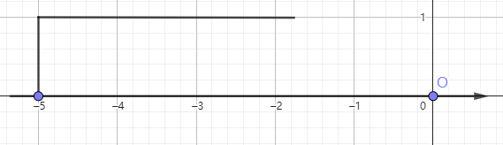

注意：若解集符号为$<$或$>$，则点需画**空心点**；若为$\le$或$\ge$，则点需画**实心点**

#### 不等式的解

​	能使不等式成立的未知数的值

#### 不等式的解集

​	一个含有未知数的不等式的**所有解的集合**，简称不等式的解集

求不等式解集的过程叫**解不等式**

---

### **11.3 不等式的性质**

不等式的两边同时加减同一个数，不等式符号不变

不等式的两边同时乘除同一个数：

​	正数：不等式符号不变

​	负数：不等式符号改变

​	0：乘法变为等式，除法错误

---

### 11.4 解一元一次不等式

#### 步骤

1. 去分母
1. 去括号
1. 移项
1. 合并同类项
1. 系数化为一

<b>先找大范围($<,>$)，再找临界点($=$)</b>

---

### 番外 - 含参方程&不等式

在一元一次方程$ax=b$中，$x=\begin{cases}\frac{b}{a}\space(a\ne0)\\\infty\space(a=0,b=0)\\\phi\space(a=0,b\ne0)\end{cases}$

在一元一次不等式$ax>b$中，$\begin{cases}x>\frac{b}{a}\space(a>0)\\x<\frac{b}{a}\space(a<0)\\x=\phi\space(a=0,b\ge0)\\x=\infty\space(a=0,b<0)\end{cases}$

---

### 11.5 用一元一次不等式解决问题

无

---

### 11.6 一元一次不等式组

#### 一元一次不等式组

​	由**多个一元一次不等式**联立($\and$)得到

#### 不等式组的解集

1. 所有不等式解集的公共部分
2. 使所有不等式同时成立的部分

#### 不等式组的解法

1. 画数轴分析
1. 结论 

#### **不等式组的结论**

​	同大取大 $\begin{cases}x>1\\x>2\end{cases}\Rightarrow x>2$

​	同小取小  $\begin{cases}x<-1\\x<-2\end{cases}\Rightarrow x<-2$

​	大小小大中间找 $\begin{cases}x<1\\x>-2\end{cases}\Rightarrow -2<x<1$

​	大大小小无处找 $\begin{cases}x<-1\\x>2\end{cases}\Rightarrow x=\phi$

---

### 番外 - 含参不等式组

已知一元一次不等式组$\begin{cases}x>a\\x<1\end{cases}$

​	当$a>1$时，$\begin{cases}x>a\space(a>1)\\x<1\end{cases}$，大大小小无处找，无解

​	当$a=1$时，$\begin{cases}x>1\\x<1\end{cases}$，无解

​	当$a<1$时，$\begin{cases}x>a\space(a<1)\\x<1\end{cases}$，大小小大中间找，有解

先找大范围(<,>)，再找<b>临界点(=)</b>

已知一元一次不等式组$\begin{cases}x>a\\x<1\end{cases}$有$n$个整数解

1.  画数轴
1. **确定特殊解**
1. 确定大范围
1. 确定**临界值**(**代入**查看解是否满足题意)

---

## 第五单元 - 走进图形世界

### 5.1 丰富的图形世界

#### 棱柱

顶面，底面，侧面，$n$条侧棱，$3n$条棱，**顶面全等于底面**

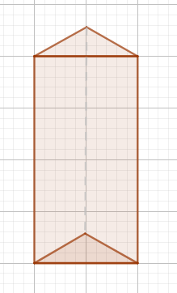

#### 棱锥

底面，侧面，$n$条侧棱，$2n$条棱

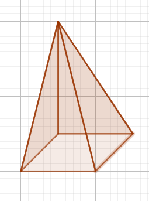

#### 台体

顶面，底面，$n$条侧棱，$3n$条棱，**顶面与底面不全等**

#### 圆柱

顶面，底面，侧棱，侧面(展开图为四边形)

#### 圆锥

底面，侧棱，侧面(展开图为半圆)

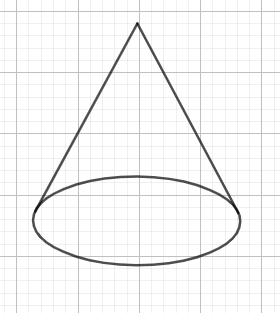

#### 圆台

顶面，底面，侧棱，侧面(展开图为不规则图形)

#### 球

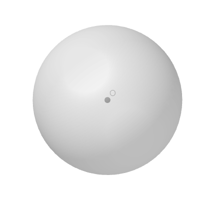

---

### 5.2 图形的运动

#### 平移

​	不改变图形的形状和大小，将其移动至另一位置

#### 旋转

​	不改变图形的形状和大小，将其绕一点旋转

#### 翻折(轴对称)

​	不改变图形的形状和大小，沿着对称轴将图形翻折

---

### 5.3 展开与折叠

#### 展开图

​	棱柱

​		多个平行四边形+两个全等的多边形

​	棱锥

​		多个三角形+一个多边形

​	棱台

​		多个梯形+两个不全等的多边形

​	圆柱

​		一个平行四边形+两个全等的圆

​	圆锥

​		一个扇形+一个圆

​	圆台

​		一个梯形+两个不全等的圆

#### 正方体展开图(11种)

---

### 5.4 主视图、左视图、俯视图

主视图：正面视图

左视图：左面视图

俯视图：上面视图

主视图&左视图面长对正

主视图&俯视图面高平齐

左视图和俯视图面宽相等

*用主视图确定立体图形位置最方便*

---

## 第六单元 - 平面图形的认识（一）

### 6.1 线段、射线、直线

|      | 端点 | 延长线 | 限制 | 符号                        |
| ---- | ---- | ------ | ---- | --------------------------- |
| 线段 | 2个  | 2      | 有限 | $线段AB=线段BA=线段\alpha$  |
| 射线 | 1个  | 1      | 无限 | $射线AB=射线\beta\ne射线BA$ |
| 直线 | 0个  | 0      | 无限 | $直线AB=直线BA=直线\gamma$  |

**射线的表示：第一个字母为端点**

#### 基本事实

1. 两点之间线段最短
2. 两点确定一条直线

#### 延长

​	沿一端点延长线段(变为射线)或射线(变为直线)

#### 反向延长

​	沿一端点的相反方向延长线段或射线

#### 线段中点

​	使线段左右两边长度相等的点

##### 	**判定&性质**

		1. $AC=BC$
		1. $AC(BC)=\frac{1}{2}AB$
		1. $AB=2AC(BC)$

已知直线上点个数，求线段个数：$\frac{n(n-1)}{2}=1+2+3+...+(n-1)$

*同一平面内三点确定三条直线*

#### 比较线段长度

1. 度量法(测量长度)
2. 叠合法(重叠一段点看与端点的远近程度)

---

### 6.2 角

#### 定义

​	静态 - 由两条有公共端点的射线组成的图形

​	动态 - 一条射线绕其端点旋转之后得到的图形

| 名称 |           角度            |
| :--: | :-----------------------: |
| 锐角 |  $0\degree<x<90\degree$   |
| 直角 |       $x=90\degree$       |
| 钝角 | $90\degree<x<180\degree$  |
| 平角 |      $x=180\degree$       |
| 周角 |      $x=360\degree$       |
| 劣角 |  $0\degree<x<180\degree$  |
| 优角 | $180\degree<x<360\degree$ |

#### 比较角度大小

​	1. 度量法(量角器)

2. 叠合法

#### 度、分、秒

$1\degree=60^{\prime}=3600^{\prime\prime}$

时钟夹角公式$\theta=|5.5y-30x|$，$x$为小时数，$y$为分钟数

#### 角平分线

​	一条平分一个角的**射线**

##### **性质&判定**

​	$\angle ABD=\angle CBD=\frac{1}{2}\angle ABC$,$\angle ABC=2\angle ABD=2\angle CBD$

---

### 6.3 余角、补角、对顶角

#### 余角

​	两个度数相加等于$90\degree$的角

##### 判断

$\because \angle1+\angle2=90\degree\\\therefore\angle1与\angle2互余$

##### 性质

$\because \angle1与\angle2互余\\\therefore\angle1+\angle2=90\degree$

#### 补角

​	两个度数相加等于$180\degree$

##### 判断

$\because \angle1+\angle2=180\degree\\\therefore\angle1与\angle2互补$

##### 性质

$\because \angle1与\angle2互补\\\therefore\angle1+\angle2=180\degree$

互为邻补角：两个有公共顶点和公共边的补角，即一条边重合，另一条互为反向延长线

#### 余补角性质定理

同(等)角的余(补)角相等

#### 对顶角

​	一角的两条边为另一角两边的反向延长线的两个角互为对顶角

##### 性质

​	对顶角相等

---

### 6.4 平行

#### 两直线位置关系

1. 平行(左下图)
2. 相交(右下图)
3. 重合(共线)(下下图)
4. 异面(下下下图)

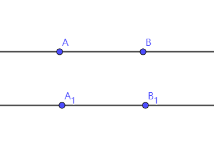

#### 平行

​	在同一平面内不相交的两条直线互相平行，写作$a//b$

​	线段和射线的平行关系参照其所在直线的平行关系

#### 画图过程

​	一放 二贴 三移 四画

#### 平行性质

​	**过直线外一点，有且只有一条直线与已知直线平行**

​	平行于同一直线的两直线平行

#### 方格纸

​	方格点上作线段可写成$a\times b$的线段，其中$a$为水平偏移距离，$b$为垂直偏移距离

​	方格纸上$a\times b$的线段与$ac\times bc\space(c\ne0)$的线段**平行**

---

### 6.5 垂直

#### 定义

​	两条直线相交产生的角为$90\degree$时，这两条直线互相垂直，记作$l_1\perp l_2$，$l_1$和$l_2$互为对方的垂线

#### 性质

​	若线段垂直，则角为$90\degree$

#### 判定

​	若角为$90\degree$，则线段垂直

#### 垂直性质

​	**过一点，有且只有一条直线与已知直线垂直**

​	画线段和射线的垂线就是画其所在直线的垂线

​	垂直于同一直线的两直线平行

#### 方格纸

​	$a\times b$的线段的垂线是$b\times a$的线段

#### 垂线段

​	连接直线外一点与垂足的线段是垂线段

#### 垂线段的性质

​	直线外一点与直线上一点连接的所有线段中，垂线段长度最短，即**垂线段最短**

​	**点到直线的距离就是垂线段的长度**

---

# 七下

## 第七单元 - 平面图形的认识（二）

### 7.1 探索直线平行的条件

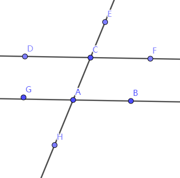

#### 同位角

​	两个处于**截线同旁**(同)，**被截线同方向**(位)的角，两角的边的连线像"F"

​	上图例体现为$\angle GAH和\angle DCA$

#### 内错角

​	两个处于**截线异侧**(错)，**被截线内侧**(内)的角，两角的边的连线像"Z"

​	上图例体现为$\angle DCA和\angle CAB$

#### 同旁内角

​	两个处于**截线同侧**(同旁)，**被截线内侧**(内)的角，两角的边的连线像"C"

​	上图例体现为$\angle GAC 和\angle DCA$

#### 平行的性质

​	两直线平行，同位角相等

​	两直线平行，内错角相等

​	两直线平行，同旁内角互补

#### 平行的判定

​	同位角相等，两直线平行

​	内错角相等，两直线平行

​	同旁内角互补，两直线平行

#### 格式

$\because \angle A = \angle B\degree\\ \therefore a//b$	

$\because \angle A + \angle B = 180\degree\\ \therefore a//b$

---

### 7.2 探索平行线的性质

#### 证明平行的性质

​	$$证明"两直线平行,内错角相等":\\作AB,CD被EF所截,且AB//CD\\已知AB\\CD,求证\angle 1=\angle 2\\证明:\because AB//CD\\\therefore \angle 1 = \angle 3\\\therefore \angle2=\angle3(对顶角相等)\\\therefore \angle1=\angle2$$

$$证明"两直线平行,同旁内角互补":\\作AB,CD被EF所截,且AB//CD\\已知AB\\CD,求证\angle 1+\angle 4=180\degree\\证明:\because AB//CD\\\therefore \angle1+\angle2=180\degree\because\angle2+\angle4=180\degree\\\therefore\angle 1 +\angle4=180\degree$$

---

### 7.3 图形的平移

#### 定义

​	将图形向一方向移动一定距离

​	大小方向形状不变

​	位置改变

#### 性质

​	对应点连线平行且相等

---

### 7.4 认识三角形

#### 定义

​	三条线段首尾相连形成的图形

#### 元素

​	3个顶点

​	3条边

​	3个角

#### 符号

​	$\triangle ABC=\triangle BAC = \triangle CBA = ...$(字母无顺序)

​	直角三角形:$Rt\triangle ABC$,$\angle B$为直角

#### 分类

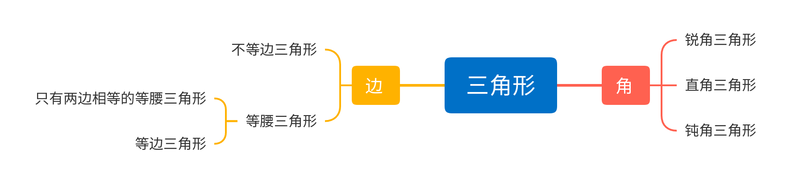

#### 三角形三边关系

任意两边之和大于第三边

​	$\begin{cases}a+b\gt c\\a+c\gt b\\b+c\gt a\end{cases}$

任意两边之差小于第三边

$\begin{cases}a\gt|b-c|\\b\gt|a-c|\\c\gt|a-b|   \end{cases}$

#### 三角形第三边取值范围

​	$|a-b|<c<a+b$

#### 中线、角平分线、高(线)

​	**中线**平分三角形一边长度

​	**角平分线**平分三角形一角

​	**高(线)**即作三角形一点到其对边的**垂线段**

​	**中线、角平分线、高(线)都是线段**

---

|            |                   三条中线                   |                 三条角平分线                 |                  三条高(线)                   |
| :--------: | :------------------------------------------: | :------------------------------------------: | :-------------------------------------------: |
| 锐角三角形 |  |  |  |
| 直角三角形 | 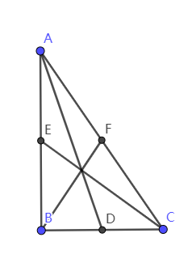 |  |  |
| 钝角三角形 |  |  | 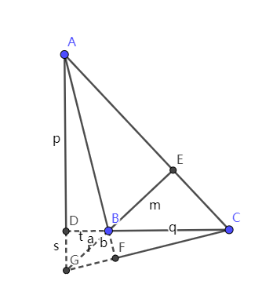 |

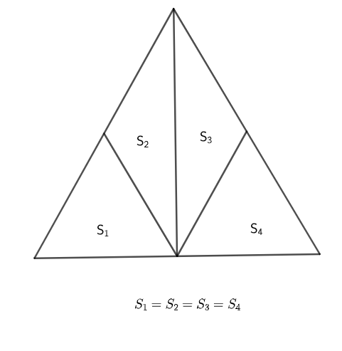

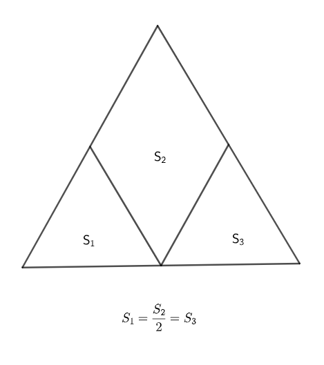

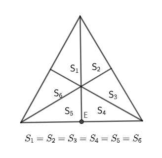

---

### 7.5 多边形的内角和与外角和

#### 定理1

​	三角形内角和为$180\degree$

##### 	证明

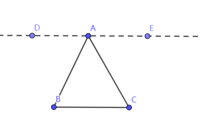

###### 法1

$证明:过点A作AD//BC并反向延长至点E\\\because AD//BC\\\therefore \angle DAC=\angle C,\angle EAB=\angle B(两直线平行，内错角相等)\\又\because \angle EAB+\angle BAC+\angle CAD=180\degree(平角的定义)\\\therefore \angle B+\angle BAC+\angle C=180\degree$

###### 法2

$证明:过点A作AD//BC\\\because AD//BC\\\therefore\angle DAB+\angle B=180\degree,\angle DAC=\angle C\\(两直线平行，内错角相等，同旁内角互补)\\又\because \angle DAB=\angle DAC+\angle CAB\\\therefore \angle BAC+\angle C+\angle B=180\degree$

##### 推论

​	在$Rt\triangle ABC$中，两个锐角互余

#### 多边形

​	同一平面内由多条线段首尾相连组成的图形，由$n$条线段组成就称为$n$边形

​	正多边形：每个内角相等，每条线段长度相等

#### 对角线

​	多边形中**连接一个顶点和与之不相邻的顶点的线段**

#### 定理2

​	$n$边形内角和$180\degree(n-2)$

​	$n$边形对角线数$\frac{n(n-3)}2(n\gt3)$

​	正$n$边形每个内角度数$(180\degree-\frac{360\degree}n)$

#### 多边形的外角

​	多边形一内角的邻补角

​	其邻边的延长线

#### 定理3

​	三角形任意一个外角**等于**与之不相邻的两个内角的**和**

#### 多边形的外角和

​	多边形的外角和固定为$360\degree$

#### 八字模型

$证明:\angle A+\angle B=\angle C+\angle D\\证:\because \angle AOD是\triangle ABO的外角\\\therefore \angle AOD=\angle A+\angle B\\又\because \angle AOD是\triangle DOC的外角\\\therefore \angle AOD=\angle C+\angle D\\\therefore \angle A+\angle B =\angle C+\angle D$

#### "$M$"形

$已知AB//CD,求证\angle BEC=\angle B+\angle C\\$

##### 法1

$证:过点E作EF//CD\\\because  CD//EF,AB//CD\\\therefore AB//EF\\\therefore \angle BEF=\angle B\\\because EF//CD\\\therefore \angle FEC=\angle C\\\because \angle BEC=\angle BFE+\angle FEC\\\therefore \angle BEC=\angle B+\angle C$

##### 法2

$证明:延长BE至点G,交CD于点G\\\because AB//CD\\\therefore \angle EGC=\angle B\\\because \angle BEC是\triangle ECG外角\\\therefore \angle BEC=\angle C+\angle EGC=\angle C+\angle B$

#### 三角形角平分线模型

##### 两内角角平分线

###### 结论

$\angle O=90\degree+\frac{1}2\angle A$

###### 证明

$证:\angle OBC+\angle OCB=\frac{1}2\angle ABC+\frac{1}2\angle ACB=\frac{1}2(180\degree-\angle A)=90\degree-\frac{1}2\angle A$

##### 一内一外角平分线

###### 结论

$\angle P=\frac12\angle A$

###### 证明

$证:\angle ACB=180\degree-\angle A-\angle ABC\\\therefore \angle ACD=\angle A+\angle ABC \\\therefore \angle ACP=\frac12\angle A+\angle PBC\\\angle PCB=\frac12\angle A+\angle PBC+\angle ACB\\\therefore \angle P=180\degree-\angle PCB-\angle PBC=\frac12\angle A$

##### 两外角角平分线

7

###### 结论

$\angle P=90\degree-\frac12\angle A$

###### 证明

$证:\angle CBP+\angle BCP=\frac12(\angle CBD+\angle BCE)=90\degree+\frac12\angle A\\\therefore \angle P=180\degree-\angle CBP-\angle BCP=90\degree-\frac12\angle A$

---

## 第八单元 - 幂的运算

### 8.1 同底数幂的乘法

#### 幂

​	$a^n$，$a$为底数，$n$为指数

​	$a^n=\underbrace{ a\times a\times ...\times a}_{n个a}$

#### 同底数幂的乘法公式

​	$a^m\cdot a^n=a^{m+n}$,$a^{m+n}=a^m\cdot a^n\space(m\in N*\and \space n\in N*)$

---

### 8.2 幂的乘方与积的乘方

#### 幂的乘方

​	$(a^m)^n=a^{mn},a^{mn}=(a^m)^n\space(m\in N*\and \space n\in N*)$

#### 积的乘方

​	$(ab)^n=a^nb^n,a^nb^n=(ab)^n$

---

### 8.3 同底数幂的除法

#### 同底数幂的除法公式

​	$a^m\div a^n=a^{m-n},a^{m-n}=a^m\div a^n(a\ne0,m\in N*\and \space n\in N*)$

#### 其他公式

​	$a^0=1(a\ne0)$

​	$a^{-n}=\frac{1}{a^n}(a\ne0,n\in N),故a^{-1}=\frac{1}a,即为a的倒数$

​	$(\frac{a}{b})^m=\frac{a^m}{b^m}(b\ne0)$

#### 科学计数法

​	$a\times10^{-n}(1\le|a|\lt10,n\in N*)$

​	$n$为小数中第一个非零数前$0$的个数(包括整数位数的$0$,如$0.abcd$中个位的$0$)

#### 幂为1

​	$\begin{cases}a^0=1(a\ne0)\\1^n=1\\(-1)^{2n}=1(n\in N*)\end{cases}$

#### 两幂相乘

​	**指数一样或底数一样**

---

## 第九单元 - 整式乘法与因式分解

### 9.1 单项式乘单项式

#### 法则

​	系数相乘，字母指数相乘(包括幂)

​	$\begin{align*}(2x)^3\cdot4(y\cdot2z)^2\div x&=8x^3\cdot4y^2\cdot4z^2\div x\\&=(8\times4\times4)\cdot(x^3\cdot y^2\cdot z^2\div x)\\&=128x^2y^2z^2\end{align*}$

**使用运算律以提升运算速度**

---

### 9.2 单项式乘多项式

#### 法则

​	单项式分别乘上多项式的每一项，并把所得的结果相加

​	$\begin{align*}-x^3y^2(7xy-8y^2+2x^3-1)&=-x^3t^2\cdot 7xy-(-x^3y^2\cdot8y^2)+(-x^3y^2\cdot2x^3)+x^3y^2\\&=-7x^4y^3+8x^3y^4-2x^6y^2+x^3y^2\end {align*}$

**使用运算律以增强运算准确率**

---

### 9.3 多项式乘多项式

#### 法则

​	多项式中每一项分别与多项式中每一项相乘，并把结果合并同类项

$\begin{align}(-x^2+y)(x-y^3+2x^2)&=-x^2\cdot x-x^2\cdot(-y^3)-x^2\cdot2x^2+y\cdot x+y\cdot (-y^3)+y\cdot 2x^2\\&=-x^3+x^2y^3-2x^4+xy-y^4+2x^2y\end{align}$

---

### 9.4 乘法公式

#### 完全平方公式

​	$(a\pm b)^2=a^2+b^2\pm2ab$

​	注意完全平方式的**双、多解**

#### 平方差公式

​	$a^2-^2=(a+b)(a-b)$

#### 完全立方公式

​	$(a±b) ^3=a^3±3a^2b+3ab^2±b^3$$

#### 立方和公式

​	$a^3+b^3=(a+b)(a^2-ab+b^2)$

​	$a^3-b^3＝(a-b)(a^2+ab+b^2)$

<b>利用公式简便计算</b>

---

### 9.5 多项式的因式分解

详情请查看https://math.xhsy220506.top/factorization

##### **因式分解具有唯一性，不同方法所得的结果应相同**

---

## 第十单元 - 二元一次方程组

### 10.1 二元一次方程

#### 定义

​	有两个未知数(二元)且未知数次数都为1(即最高次项的次数为1)(一次)的**整式方程**

#### 形式

​	$ax+by+c=d(a\ne0\and b\ne0)$

#### 解

​	一组使方程成立的数

#### 解的形式

​	$\begin{cases}x=a\\y=b\end{cases}$

---

### 10.2 二元一次方程组

#### 定义

​	多个二元一次方程联立形成的方程组

#### 形式

​	$\begin{cases}x+a=b\\y+c=d\end{cases}$

#### 解

​	使方程组中方程同时成立的未知数的值

​	方程组中方程的公共解

---

### 10.3 解二元一次方程组

#### 代入消元法

1. 将方程组中**一个**方程转换为$x=$或$y=$(以此类推)的形式
2. 将得到的式子**代入其他方程**以达到消元的目的
3. 重复上述步骤直到方程变为一个**一元一次方程**
4. 解一元一次方程并回代
5. 求出方程组的解

解方程组：$\begin{cases}x+y=12\\2y-x=50\end{cases}$

$解:设x+y=12为A,2y-x=50为B\\由A得x=12-y\\代入B得2y-12+y=50,解得y=\frac{62}3\\代入x=12-y得x=-\frac{26}3\\\therefore原方程组的解为\begin{cases}x=-\frac{26}3\\y=\frac{62}3\end{cases}$

#### 加减消元法

1. 对方程组中的方程**每个**进行运算使方程组中的一个(或多个)**未知数的系数相等**
2. 将方程组中的方程**加减**得到一个一元一次方程
3. 解一元一次方程并将结果代入原方程组
4. 求出方程组的解

解方程组：$\begin{cases}x+y=12\\2y-x=50\end{cases}$

$解:设x+y=12为A,2y-x=50为B\\A+B得3y=62,解得y=\frac{62}3\\代入A得x=-\frac{26}3\\\therefore 原方程组的解为\begin{cases}x=-\frac{26}3\\y=\frac{62}3\end{cases}$

#### 补充:图像解法

<u>*此为八年级上侧一次函数单元中的方法，此处仅作为补充</u>

1. 将方程组的每个方程都转换成函数形式
2. 建立平面直角坐标系，在图中表示上述函数
3. 寻求函数的交点：若有，则交点的坐标即为方程组的解；若无，则该方程组无解

解方程组：$\begin{cases}x+y=12\\2y-x=50\end{cases}$

$解:x+y=12即y=12-x\\2y-x=50即y=25+\frac{x}2\\建立平面直角坐标系,画出图像,交点为P(-\frac{26}{3},\frac{62}{3})\\\therefore原方程组的解为\begin{cases}x=-\frac{26}3\\y=\frac{62}3\end{cases}$

---

### 10.4 三元一次方程组

通过加减消元或代入消元**将三元转换为二元**，然后解二元一次方程组

*一个方程能消一个未知数*

#### 比例方程

​	通法：**设比值$k$**，然后代入未知数

#### 轮换对称方程

​	通法：全部相加，然后分别加减原方程

---

### 10.5 用二元一次方程组解决问题

无

---

## 第十二单元 -证明

### 12.1 定义与命题

人们常用一些*名称*与*术语*(如"平行线""数轴")，对它们的含义(**性质与判定**)进行描述和规定，就是给出它们的**定义**(如"在同一平面内不相交的两条直线"是平行线的定义)

判断一件事情*是否成立*的句子叫**命题**(需要做出**判断**)

$如果\underbrace{a>0,b>0}_{条件},那么\underbrace{|a|=|b|}_{结论}$

若条件成立时结论成立，那么**再经过证明后**其为真命题

若条件成立时结论不一定成立，那么**再经过举反例后**其为假命题

---

### 12.2 证明

根据已知的真命题，确定某个命题的真实性的**过程**叫**证明**

已被证明的真命题称为**定理**

$证明过程\begin{cases}因\because\Rightarrow已知事项\\果\therefore\Rightarrow推论\\由因得果的依据'()'\Rightarrow基本事实，定义，定理等\end{cases}$

由一个定理推出的正确结论被称为**这个定理的推论**，如"三角形的外角等于与之不相邻的两个内角的和"就是由外角的定义推出的推论

**推论可以作为证明的依据**

---

### 12.3 互逆命题

若A命题的条件是B命题的结论，A命题的结论亦然，那么这两个命题**互为逆命题**

每个命题都有其逆命题

**真命题的逆命题不一定为真命题**

---

## (原八上)第一单元 - 全等三角形

<u>*注：本单元原属于八年级上册，因教学进度原因提前学习</u>

### 1.1 全等图形

#### 定义

​	形状大小相同的两个图形全等

​	两个能完全重合的图形全等

#### 符号

​	$\cong$

​	**注：此为西文字符，中文教科书中符号上方波浪线为反方向，不影响阅读(这两个符号都对，表达意义上没区别)*

#### 构造

​	平移

​	旋转

​	翻折

​	...

---

### 1.2 全等三角形

#### 定义

​	两个能完全重合的三角形

#### 符号

​	$\triangle ABC\cong \triangle DEF$(对应顶点写在对应位置上)

#### 性质

​	对应角相等

​	对应边相等

---

### 1.3 探索三角形全等的条件

#### 1. 两边及其夹角分别相等(边角边 - SAS)

